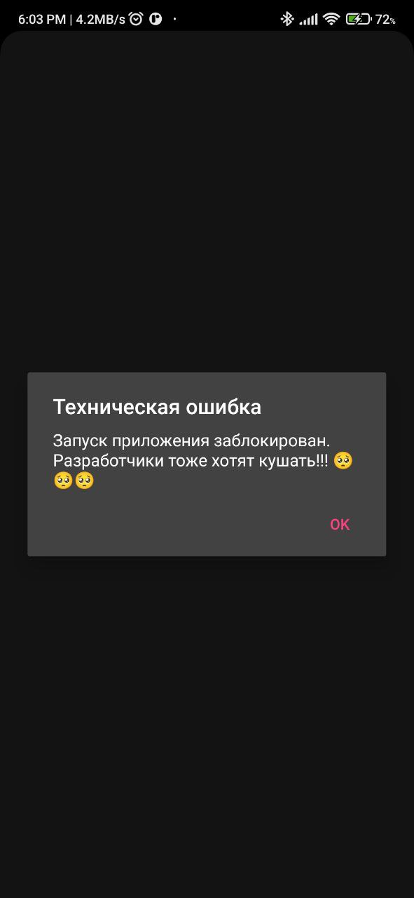

# Меня не обманешь!!!

## Цель проекта
Создать Rest API, для того чтобы блокировать мобильное приложение, в случае недобросовестности заказчика.

## Предысловие
Да, я знаю что не очень разумно использовать для этого проекто Django + DRF, но на тот момент я ещё не начал изучать FastAPI

## Установка

Клонирование проекта:
```shell
git clone https://github.com/KlimentFis/I_don-t_faith_you 
```

Переход в папку проекта:
```shell
cd I_don-t_faith_you
```

Установка и активация виртуального окружения ( Не обязательно ):
```shell
python -m venv venv && venv\Scripts\activate.bat
```

Установка зависимостей:
```shell
pip install -r requirements.txt
```

Создание миграций:
```shell
python manage.py makemigrations
```

Проведение миграций:
```shell
python manage.py migrate
```

Создание Супер-пользователя ( Не обязательно ):
```shell
python manage.py createsuperuser
```

## Запуск проекта
Для локальной разработки:
```shell
python manage.py runserver
```
Для использования по прямому назначению:
```shell
python manage.py runserver 0.0.0.0:8888
```
## Заключение
❗❗❗ Поменять адрес нужно в мобильном приложении, или в другом месте, где вы собираетесь использовать данный код.
При вводе в эксплутацию, не забудьте поменять локальный адрес на реальный ip, чтобы проект действительно работал, и приносил вам пользу.
😅😅😅

## Руководство по Rest API
### id  - целое число, передаваемое на прямую
- ### GET api/change_naeb/id - Для инвертирования статуса проекта, с переданным id 
- ### POST /api/is_naeb/id - Для создания проекта, по пераданным значениям
Пример входного JSON:
```json
{
    "name": "Название проекта",
    "is_naeb": false
}
```
- ### GET /api/is_naeb/id - Возврат статуса нужного проекта
- ### GET /api/all_projects/ - Для возврата всех проектов, и их статусов

## Пример использования
```
protected override void OnCreate(Bundle savedInstanceState)
{
  base.OnCreate(savedInstanceState);
  CheckIsNaebAsync();
}

private async Task CheckIsNaebAsync()
{
  string apiUrl = "http://192.168.1.16:8888/api/is_naeb/2";
  bool isNaeb = false;

  using (HttpClient client = new HttpClient())
  {
    HttpResponseMessage response = await client.GetAsync(apiUrl);

    if (response.IsSuccessStatusCode)
    {
      string responseContent = await response.Content.ReadAsStringAsync();
      var responseObject = JsonConvert.DeserializeObject<dynamic>(responseContent);

      // Проверка наличия поля "is_naeb" в ответе
      if (responseObject.ContainsKey("is_naeb"))
      {
      	isNaeb = (bool)responseObject["is_naeb"];
      }
      else
      {
        // Если поле "is_naeb" отсутствует в ответе
        ShowAlert("Ошибка", "Поле 'is_naeb' не найдено в ответе");
        return;
      }
    }
 	else
    {
      // Вывод сообщения об ошибке в случае неудачного запроса
      ShowAlert("Ошибка", $"Ошибка при выполнении запроса: {response.StatusCode}");
      return;
    }
  }

  if (!isNaeb)
  {
    Xamarin.Essentials.Platform.Init((Activity)Android.App.Application.Context, null);
    Forms.Init(this, null);
    LoadApplication(new App());
  }
  else
  {
  	ShowAlert("Техническая ошибка", "Запуск приложения заблокирован. Разработчики тоже хотят кушать!!! 🥺🥺🥺");
  }
}

private void ShowAlert(string title, string message)
{
  AlertDialog.Builder builder = new AlertDialog.Builder(this);
  builder.SetTitle(title);
  builder.SetMessage(message);
  builder.SetPositiveButton("OK", (senderAlert, args) => { });

  Dialog dialog = builder.Create();
  dialog.Show();
}

public override void OnRequestPermissionsResult(int requestCode, string[] permissions, [GeneratedEnum] Android.Content.PM.Permission[] grantResults)
{
  Xamarin.Essentials.Platform.OnRequestPermissionsResult(requestCode, permissions, grantResults);
  base.OnRequestPermissionsResult(requestCode, permissions, grantResults);
}
```

## Результат

